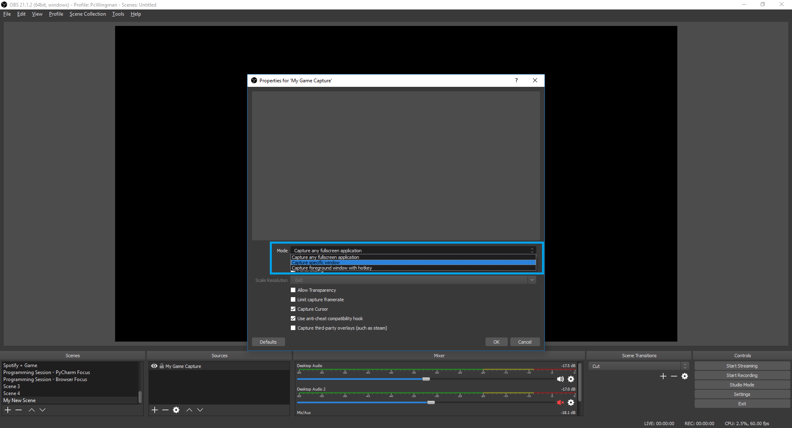
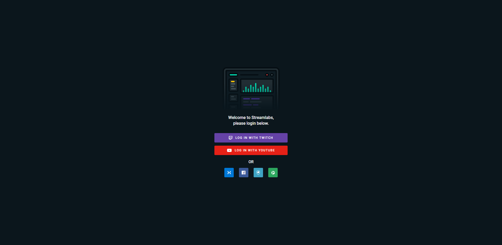

# Full Startup Guide - Using Twitch, OBS, and StreamLabs

[Back To Main Page](./README.md)

## Twitch
  First you will want to [signup](https://www.twitch.tv/signup) on Twitch if you haven't already.

  

  Once you have finished the signup process, make sure to log in.

  Next, while logged in, you will want to click on the dropdown menu in the top-right corner and click dashboard. Or simply go to [this](https://www.twitch.tv/the_outis/dashboard/) link.

  

  Once in the dashboard proceed to the Channel option under Settings in the left bar.

  

  This page shows a general list of settings/options you can enable for your stream. They are entirely self preference; so, take the time now to go over them and see if you would want it or continue here.

  The key part you will see is your Stream Key. This will be given to OBS to allow the software to stream to your respective channel. Either copy this now or keep a reference to this page.

  

  Please make sure to become familiar with the layout of your account on Twitch. There are many neat pages that Twitch gives you to see statistics and live stats for your stream. The live dashboard displayed above is great for when you are live. The analytics page shows great info after your stream.

  ## OBS
  ### Setup
  To install OBS go to this [page](https://obsproject.com/). Click on your respective operating system and the download should start for the installer.

  

  The installation process is quite easy, just keep hitting next. There aren't really any options unless you are picky as to where it is installed on your HD/SSD.

  When you first launch the app, it will look something like below. Ignore my scenes that I already have setup, yours should have just a default scene + source. We will be creating our own shortly

  

  ### Settings

  First let's start by going through the settings. Like I mentioned earlier OBS has quite a lot of settings to fine tune your stream experience. To go to the settings click "File" in the upper-left corner and then "Settings" in the dropdown

  

  You will start out in the general settings. Here you can select your Language, Theme (dark all the way), and update checking. It also has general system preferences like confirmation dialogs, system docking, and snap aligning for the overlay editor.

  

  Next is the Streaming settings. This is a basic page that allows you to pick which service you would like to stream to and what server you will stream on. Here you can enter that Stream Key we found in our Twitch Settings from earlier on.

  

  The next most important area is the Output Settings. Here you can select your encoder, rescale output, bit rate, and cpu usage/profile.

  For the most general users I suggest using x264 for your encoder. If you remember the options you went through in the calculator from the [Internet](./README.md#internet) portion of the main README you can enter them here. I usually go with a 1280x720 rescale, 3500 bitrate, and a fast cpu usage. The cpu usage may take some tweaking to see what % you want OBS to be taking up while you are streaming. For the most part fast or below is good for quality though.

  

  On this page you can also edit your normal video/audio recording if you are making a video or voice over track.

  The next page has all of your audio settings. For the most part you can leave everything as default, but make sure your audio devices (Mic & Sound) are correct for the devices you want.

  

  On the video settings page you can select your base resolution, I have mine set to 1920 x 1080 for good quality and then rescale on the output side.

  You can also select your downscale filter here. I usually opt for Lanczos since it gives better quality (less blur) when scaling and my hardware can withstand it. If you are having trouble with running the stream you can always swap to Bilinear which is faster, but more blurry if you are scaling at all.

  Your fps for your stream is set here as well. I currently use 60 fps, 30 fps is another good option as well.

  

  The hotkeys page is a fantastic resource for customizability. Here you can keybind basically any functionality to your hearts content.

  Some recommended keybinds are Start/Stop stream and transitions between your scenes. I generally use some modifier like Alt or Ctrl + a numpad key for scenes. Make sure your start/stop stream binds are not easy to mistakenly hit.

  

  The advanced page doesn't have much of use for actual streaming, but there are a few key things. Process priority can be nice to set if you are having trouble with OBS running slow. You can also manage this in your task manager as well.

  If you need to setup a stream delay for some reason or another (EX: tournament matches) you can enable this here also.

  

  ### Functionality - Scenes, Sources, Filters, etc...
  #### Add Scene
  To create a new scene press the + button in the bottom left corner in the scenes section. After this you can enter in a custom name and hit OK.

  

  #### Add Source
  To add sources to a scene click the + button in the sources section and you will be presented with list of options for sources. For the purposes of the guide go ahead and select Game Capture.

  

  Once clicked you will need to give the source a custom name or stick with the default and press OK.

  

  This will then put you into the settings for this new Game Capture source. Here you will want to select the mode and change to Capture Specific Window.

  

  After that you will want to click the window and select the option for your game. For me I selected [RocketLeague.exe].

  

  Your overlay editor should now look like something below.

  

  #### Add Mic Filter
  To add a filter to your mic, click the settings cog button to the right of your mic level and select filters.

  

  Inside the next screen, add a new filter to your filter list by clicking the + button in the bottom-left corner. From this popup list you can select the filter you want. Go ahead and select Noise Gate.

  

  In the previous Image you can see the Noise Gate I already have added to my mic. The noise gate is going to limit the activation range of your mic. I happen to have my set the defaults, because they actually work pretty well for me, but if your mic is more or less sensitive then you can adjust the range to your needs.

  Next add a Compressor filter. The compressor will automatically lower your mic level if your voice or any noise ends up spiking. For example if you start yelling or talking louder than usual. I usually leave this at the default settings as well, since it suits my needs well enough.

  

  Next add a Suppression filter. This filter will help to reduce any background noise you might have in your environment. This could range from a fan, T.V., or talking. This is especially helpful for people that have lower quality mics or headset mics (like in my case). I again just leave this at the default, edit at your discretion.

  

  At this point you should be fine enough to start streaming. Press the Start Streaming button to begin. It's always a good idea to have a family or friend to help you tweak any quality changes for your stream. Have them watch and check for any tearing, pixelation, or peaks/background noise.

  ## StreamLabs
  Go to [StreamLabs website](https://streamlabs.com/login?r=https://streamlabs.com/dashboard) to login/register to their system. You can select either Twitch, Youtube, or any of the other logins (I use Twitch for this guide). 

  

  Once you login you should land on a dashboard screen like below. This page should you any and all statistics with your stream: follows, subs, donations, etc...

  

  In the dashboard click on the Alert Box button under widgets in the left navigation menu (see picture above). Once on this Alert Box page, scroll down until you see the Widget URL. You can either launch it into a seperate window and select this as a browser source in OBS or you can use the url itself and add it as a source itself. The latter method is easier longterm since you don't need to remember to launch the alert box stream to stream.

  

  Copy the link and head over to your OBS. Create a new source with the Browser option. Inside the properties menu change the URL to be the one you copied from StreamLabs like below.

  

  Go back to streamlabs and hit the Test Follow button like below.

  

  Hurry back to your OBS and you should see the text appear your where source is on the Overlay Editor (see below for example).

  

  In the alertbox page you can edit pretty much anything about your notifications. You can add images, gifs, music, sounds, etc...

  Overall this concludes this guide. Once you have finished this you will be setup on Twitch, OBS, and StreamLabs. You are fully setup with how to make scenes, source, filters, and linking StreamLab alerts to display on your stream. You can see your statistics in StreamLabs or on the Twitch dasboard. Remember this is only breaking the surface there is a lot you can do with the tools/services, only your imagination is the limiter.

  Remember to **always** have fun streaming!
